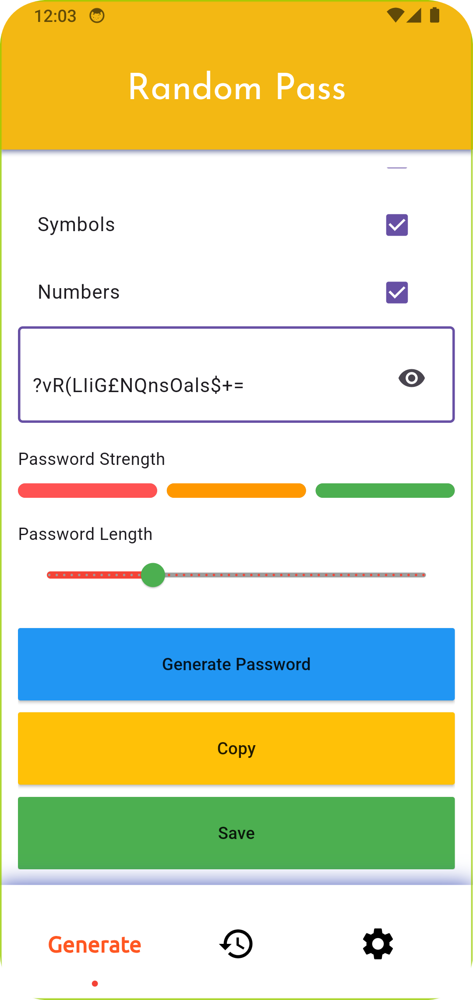

# 🔐 Random Password Generator

**A Flutter-based** Random Password Generator app that helps users create strong and secure passwords. It offers customizable options and uses Hive for storing passwords locally with titles. Perfect for enhancing your online security by generating and managing complex passwords.

## 📋 Features

- **Random Password Generation:**  
  Easily generate strong, random passwords with customizable length and character types.

- **Customizable Options:**  
  Users can include/exclude:
    - Uppercase letters
    - Lowercase letters
    - Numbers
    - Special characters

upcoming Feature: <br>
~~- **Save Passwords:**  
Store generated passwords with a title using Hive local storage.~~

~~- **View and Manage Passwords:**  
All passwords are stored securely on the device using encryption with Hive.~~

~~- **Secure Storage:**~~  
~~- All passwords are stored securely on the device using encryption with Hive.~~

- **Responsive Design**  
  Optimized for both mobile and tablet screens.


---

## 🚀 Installation

1. **Clone the Repository:**
   ```bash
   git clone https://github.com/rabby220/Password-Generator.git
   cd Password-Generator

2. **Install Dependencies::**
   ```bash
   flutter pub get

3. **Install Dependencies::**
   ```bash
   flutter run

---

## 🛠️ Tech Stack

- Flutter (Dart): Cross-platform framework for building mobile apps.
- Hive: Local storage for saving and retrieving passwords.
- GetX: State management, routing, and theming.
  ~~- Encryption: Ensures passwords are stored securely~~


---

## 📸 Screenshots


<p>
  


</p>


---

## 💡 How It Works

1. Generate Password: <br>
   Customize the password criteria (length, characters) and generate a random password.

2. ~~Save Password: <br> currently not work.
   Add a title and save the generated password securely to Hive.~~

3. View Saved Passwords:<br>
   Access and manage your stored passwords from the saved passwords screen.

4. Copy to Clipboard: <br>
   Quickly copy generated or saved passwords to your clipboard for easy use.


---


## 📝 Future Enhancements
- Implement cloud sync for password backup and multi-device support.
- Add biometric authentication for accessing saved passwords.


---

## 💡 How to Contribute

1. Fork the repository.
2. Create a new branch:
   ```bash
   git checkout -b feature-name

3. Commit your changes:
   ```bash
   git commit -m "Add some feature"

4. Push to the branch:
   ```bash
   git push origin feature-name

5. Open a Pull Request.

## 📫 Contact
If you have any questions or suggestions, feel free to reach out via [Email](mailto:fajlarabby220@gmail.com).